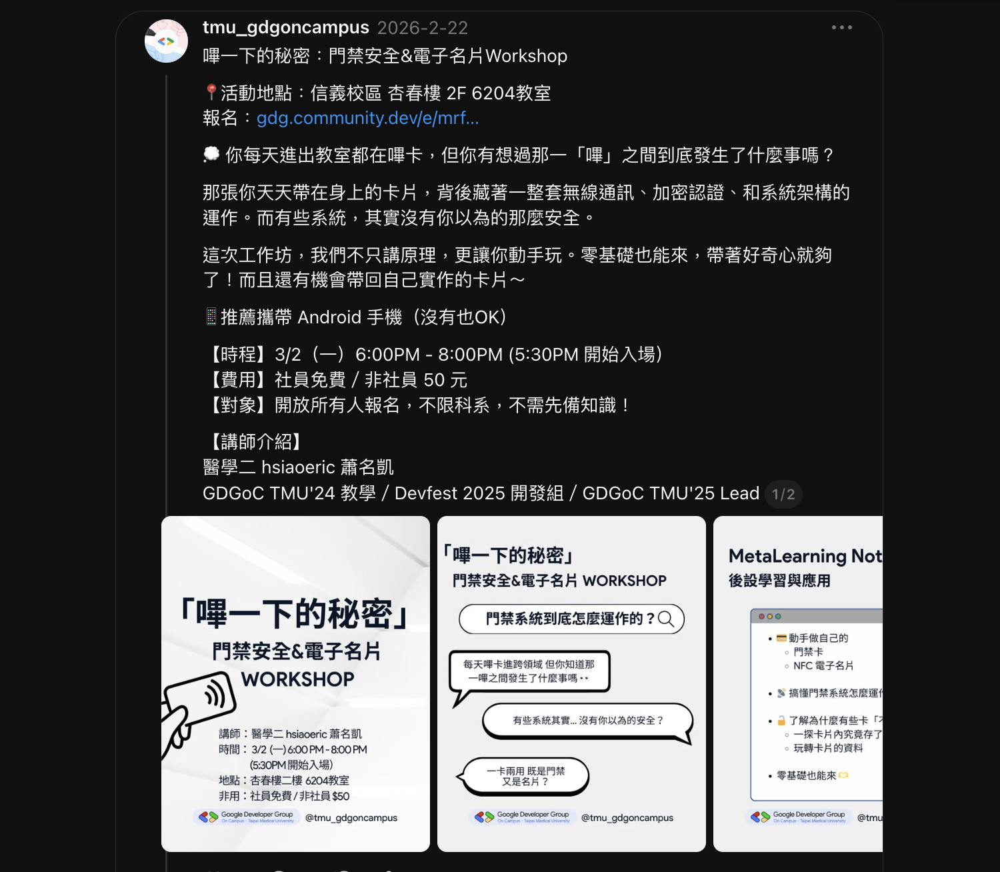
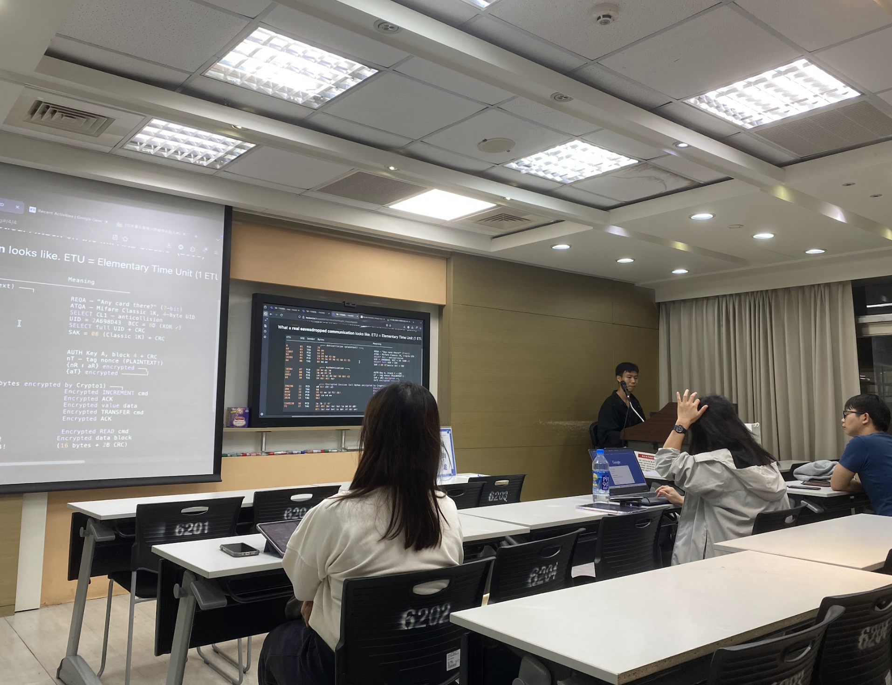
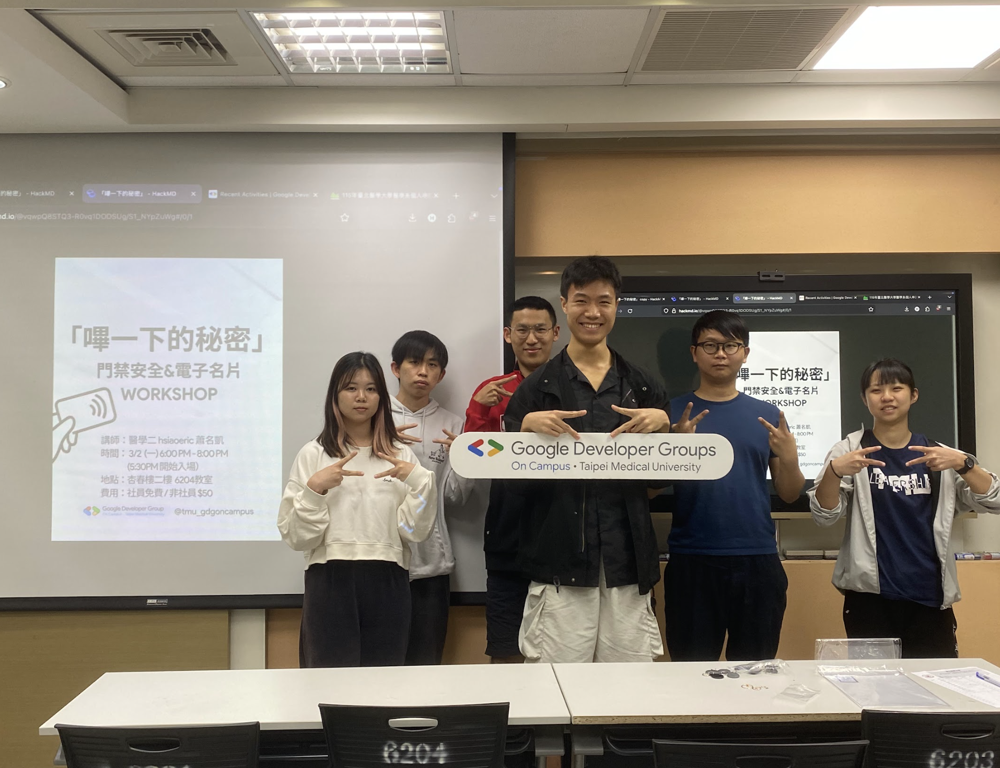
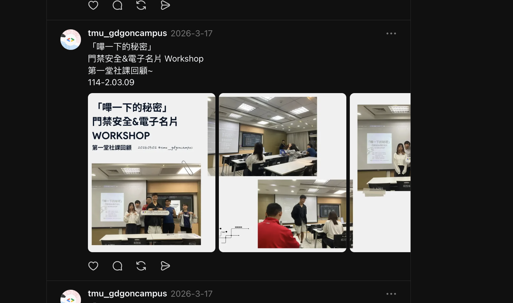

# B11｜「嗶一下的秘密」門禁安全 & 電子名片 Workshop 結案報告

## 一、活動基本資訊

| 項目 | 內容 |
|------|------|
| 活動名稱 | 嗶一下的秘密：門禁安全 & 電子名片 Workshop |
| 活動日期 | 中華民國 115 年 3 月 2 日（一）18:00–20:00（17:30 開始入場）|
| 活動地點 | 臺北醫學大學 信義校區 杏春樓 2F 6204 教室 |
| 主辦單位 | GDG on Campus TMU |
| 活動對象 | 開放所有人報名，不限科系，不需先備知識 |
| 實際參與人數 | **Bevy 平台 RSVP：9 人，實際到場：8 人**（5 名非社員 × 50 元 = 250 元）|
| 費用 | 社員免費／非社員 50 元（共收 5 名 × 50 = 250 元）|
| 講師 | **蕭名凱 hsiaoeric**（醫學二、114 學年度 GDGoC TMU Lead，前 GDGoC TMU'24 教學部、DevFest 2025 開發組）|

## 二、活動目的與宗旨

呼應社團發展計畫之「**醫療×科技跨領域應用**」重點，並結合社長親自參與 2025 神盾盃資安競賽（全國第四名）的實戰經驗，本場活動以校園學生「每日嗶卡進門」的日常情境為錨點，揭示常被忽略的資安議題。

## 三、活動內容與流程

**Part 1：門禁系統全解析**

- 每天嗶卡進門，背後其實是一條從卡片→讀卡機→控制器→電鎖的完整信號鏈
- 認識每一個環節，理解那個「嗶」到底是怎麼回事

**Part 2：你的卡有多透明？**

- 深入了解校園常見的 Mifare Classic 卡片架構
- 看看 UID 是什麼、為什麼它不是秘密
- 此類系統的安全性到底如何

**Part 3：動手時間！NFC 實作體驗**

- 拿起手機，實際讀取 NFC 標籤
- 了解卡片資料結構
- **實作：做一張屬於自己的 NFC 門禁卡 ＆ 電子名片帶回家**
- （iOS 系統限制下，部分進階 NFC 讀寫功能僅限 Android）

## 四、SDGs 永續發展對應

- **SDG 4 優質教育**：以校園情境引導非資安背景學生入門
- **SDG 9 產業創新**：培養下一代資安人才
- **SDG 10 減少不平等**：開放所有科系、不需先備知識，降低學習門檻

## 五、AI 技術應用

- **講師備課**：使用 Gemini／Claude 協助生成範例與題目設計
- **簡報設計**：「簡報的格式很酷」（學員實際回饋）顯示 AI 輔助設計帶來的視覺品質提升
- **宣傳文案**：使用 Gemini 生成 IG 貼文 + Bevy 平台描述

## 六、回饋分析（依「回饋表單 (回覆).xlsx」共 2 份回應）

| 維度 | 數據 |
|------|------|
| **整體滿意度** | **5.00 / 5**（n=2，滿分回饋）|

**代表性回饋（學員實際填寫）**：

| 「這場講座讓您有什麼收穫或啟發？」 | 「印象最深刻的部分」 |
|-----------------------------------|---------------------|
| 「背後的原理很有趣」 | 「沒想到學校的門禁這麼容易複製」 |
| 「初步瞭解悠遊卡或門禁卡背後的原理」 | 「實作門禁卡 / 電子名片  簡報的格式很酷」 |

**亮點**：學員「沒想到學校的門禁這麼容易複製」的反饋，正是本場活動希望帶給學員的「資安啟蒙時刻」。

## 七、活動檢討會議

於 2026/04/03 第 9 次幹部會議檢討：

- **正面**：社長親自授課，將神盾盃實戰經驗下放、學員給予滿分回饋
- **改進**：因實際到場人數較少（8 人），未來可考慮提早 1 個月開放校外學生報名

## 八、活動照片與佐證

宣傳：

回顧：

