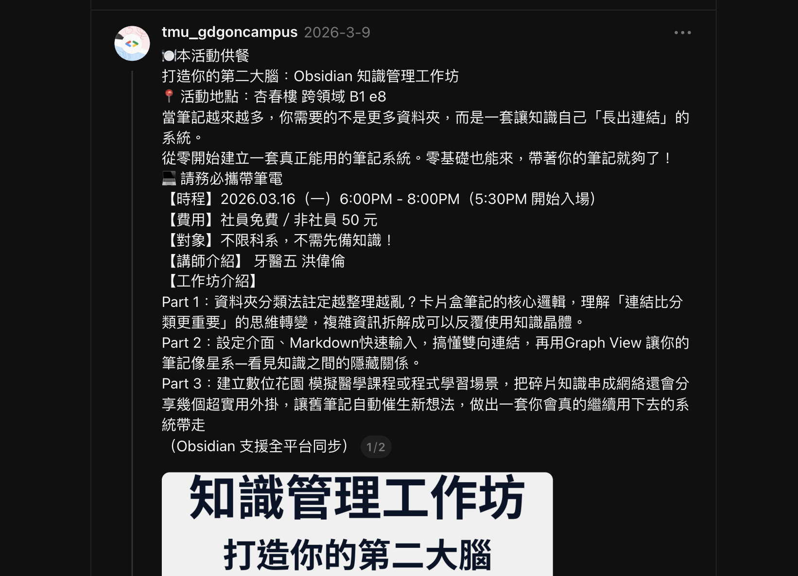
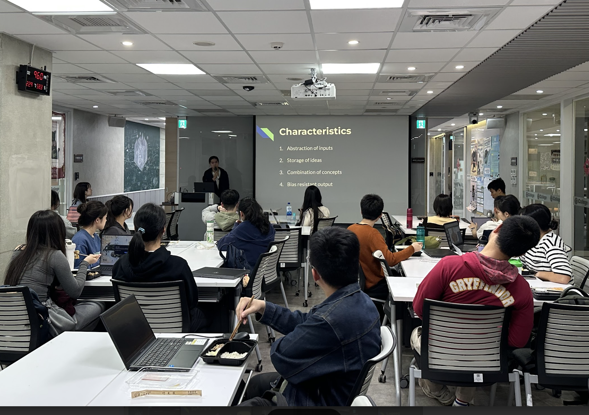
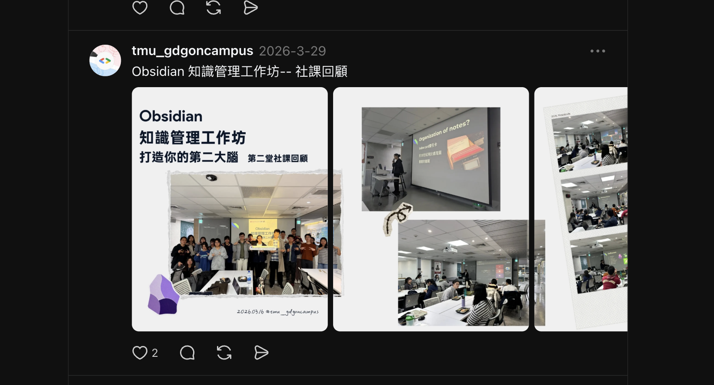

# B12｜Zettelkasten × Obsidian 知識管理工作坊 結案報告

## 一、活動基本資訊

| 項目 | 內容 |
|------|------|
| 活動名稱 | 打造你的第二大腦：Obsidian 知識管理工作坊（Zettelkasten & Obsidian 伴隨你成長的卡片盒筆記）|
| 活動日期 | 中華民國 115 年 3 月 16 日（一）18:00–20:00（17:30 開始入場）|
| 活動地點 | 臺北醫學大學 杏春樓 跨領域 B1 e8 |
| 主辦單位 | GDG on Campus TMU |
| 協辦單位 | 跨領域學習中心、Smart TMU（Meow Point 集點認列 1 點）|
| 活動對象 | 推薦醫學系、EE/CS 雙主修或任何被海量資料淹沒的同學，不限科系，不需先備知識 |
| 實際參與人數 | **Bevy 平台 RSVP：26 人**（其中 17 名非社員 × 50 元 = 850 元）|
| 費用 | 社員免費／非社員 50 元（共收 17 名 × 50 = 850 元）|
| 講師 | **洪偉倫 Stephen**（牙醫五、GDGoC TMU 教學部）|
| 講師費 | 2,200 元（已核銷撥款）|
| 膳食支出 | 1,000 元（核銷中）|

## 二、活動目的與宗旨

呼應社團發展計畫之「**醫療×科技跨領域應用**」重點，從醫學系學生考前打開筆記資料夾「東一份共筆、西一份摘要，知識碎成一地拼不回來」的真實痛點切入，引導學員：

1. 認識 Zettelkasten（卡片盒筆記法）的核心邏輯：「**連結比分類更重要**」
2. 把複雜資訊拆解成可以反覆使用的知識晶體
3. 上手 Obsidian 全平台知識管理工具，實際操作雙向連結（Backlinks）與 Graph View

## 三、活動內容與流程

**Part 1：告別線性筆記**

- 為什麼資料夾分類法註定越整理越亂？
- Zettelkasten 卡片盒筆記法的核心邏輯
- 「連結比分類更重要」的思維轉變

**Part 2：Obsidian 核心實操**

- 設定介面、上手 Markdown 快速輸入
- 雙向連結（Backlinks）的威力
- 用 Graph View 讓筆記像星系一樣展開

**Part 3：動手時間！建立你的數位花園**

- 現場模擬醫學課程或程式學習場景
- 把碎片知識串成網絡
- 分享實用外掛（Plugins），讓舊筆記自動催生新想法

> （Obsidian 支援全平台同步，Mac、Windows、Linux 都能使用！）

## 四、SDGs 永續發展對應

- **SDG 4 優質教育**：把高效能筆記法帶入校園
- **SDG 9 產業創新**：將知識管理工具導入學生日常

## 五、AI 技術應用

- **教材融合**：Obsidian 插件介紹中包含 AI plugins（如 Smart Connections、Obsidian AI）
- **講師備課**：使用 NotebookLM 整理 Zettelkasten 經典文獻
- **宣傳**：使用 Gemini 生成多版本 IG 貼文與 Bevy 平台描述

## 六、回饋分析（依「Zettelkasten & Obsidian 伴隨你成長的卡片盒筆記 (回覆).xlsx」共 9 份回應）

| 維度 | 數據 |
|------|------|
| **整體滿意度** | **4.78 / 5**（n=9）|

**代表性回饋（學員實際填寫）**：

| 「這場講座讓您有什麼收穫或啟發？」 | 「印象最深刻的部分」 |
|-----------------------------------|---------------------|
| 「感覺特別厲害」「Obsidian 好複雜」「筆記管理」「了解 obsidian 的功能以及可以如何應用」「學習到 obsidian 的操作方法」 | 「沒想到有能力那麼強的程式」「看到知識網」「插件」「講師帶我們實際操作的部分」「暫存筆記和永久筆記的部分」 |

**情感分析摘要**：

- 「看到知識網」「沒想到有能力那麼強的程式」顯示學員對 Graph View 的視覺衝擊印象深刻
- 「講師帶我們實際操作」呼應 Part 3 的實作環節成功
- 「Obsidian 好複雜」也提示未來可分為「入門」與「進階」兩場次

## 七、活動檢討會議

於 2026/04/03 第 9 次幹部會議檢討：

- **正面**：22 人參與、滿意度 4.78/5、Obsidian 全平台特性吸引跨系所學生
- **改進**：學員提及「Obsidian 好複雜」，未來可分入門／進階兩場

## 八、活動照片與佐證

- 照片：「PXL_20260316_102235084.jpg」
- 照片資料夾：「照片記錄」
- 講師簡報：「Zettelkasten & Obsidian.pptx」
- 補充教材：「Obsidian setup 手冊.docx」
- Bevy 預售統計：「google-gdg-on-campus-taipei-medical-university-...obsidian-zhi-shi-guan-li-gong-zuo-fang-2_pre_order_survey_stats.csv」
宣傳：

回顧：

