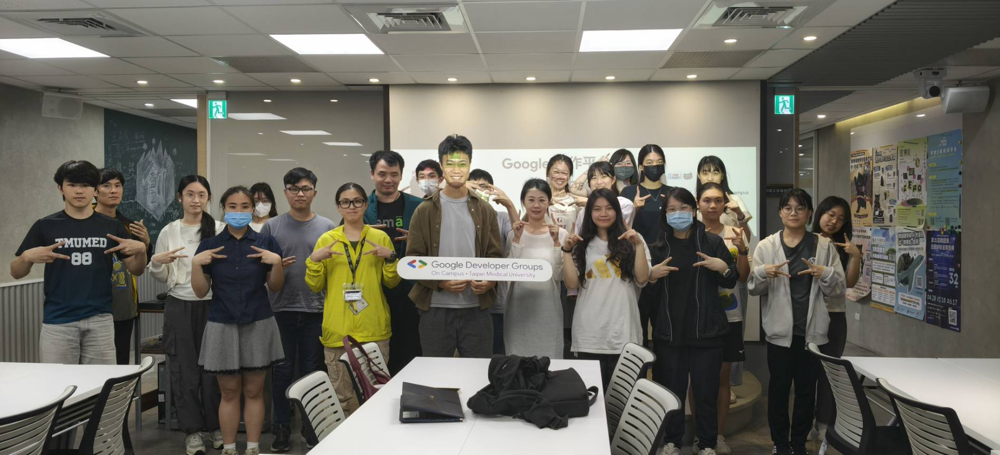

# B14｜Google 協作平台 × Lovable 實作工作坊 結案報告

## 一、活動基本資訊

| 項目 | 內容 |
|------|------|
| 活動名稱 | 打造你的第一個網站：Google 協作平台 × Lovable 實作工作坊 |
| 活動日期 | 中華民國 115 年 4 月 27 日（一）18:30–20:00（18:15 開始入場）|
| 活動地點 | 臺北醫學大學 杏春樓 跨領域 B1 e8 |
| 主辦單位 | GDG on Campus TMU |
| 協辦單位 | 跨領域學習中心、Smart TMU（Meow Point 集點認列 1 點）|
| 活動對象 | 想做社團網站、個人作品集、活動報名頁的任何人，不需要任何程式基礎，不限科系 |
| 實際參與人數 | **Bevy 平台 RSVP：22 人**（回饋表單填寫 7 人）|
| 費用 | 社員／非社員 **免費**（呼應社團發展計畫之普及策略）|
| 講師 | **鄭翊廷 Edward**（醫學二、GDGoC TMU 教學部）|
| 講師費 | 內部講師（無外部費用）|
| 備註 | 已會 Google 協作平台的同學，可直接從 Lovable 段開始挑戰 |

## 二、活動目的與宗旨

呼應社團發展計畫之「**Google 官方 AI 計畫鏈完整落地**」與「**普及 AI 工具給非工程背景學生**」。本場活動讓學員：

1. 用 Google 協作平台 5 分鐘架好一個網站（無需程式知識）
2. 用 Lovable 直接以自然語言描述，AI 幫你生成完整網頁
3. 將作品部署到可對外存取的網址

> 「不需要學程式，也不需要請人設計——你只需要知道用哪個工具，以及怎麼跟 AI 說話。」

## 三、活動內容與流程

**Part 1：Google 協作平台——5 分鐘架好一個網站**

- 從建立頁面、嵌入表單到自訂網址
- 手把手帶你完成可以實際使用的社團或個人網站
- 無需任何程式知識

**Part 2：Lovable——跟 AI 說你想要什麼，它幫你做出來**

- Lovable 是目前最受矚目的 AI 網頁生成工具之一
- 只需用文字描述功能與風格，Lovable 自動生成完整的前端介面
- 從第一句 Prompt 開始，實際跑出一個屬於自己的網頁應用

**Part 3：上線！分享你的成果**

- 將作品部署到可對外存取的網址
- 讓網站真實存在於網路上

> 不講投影片理論，全程實機操作，當天就能帶走一個可以對外分享的作品。

## 四、SDGs 永續發展對應

- **SDG 4 優質教育**：免費讓非工程背景學生上手 AI 網頁工具
- **SDG 9 產業創新**：將最新 AI 網頁生成工具引入校園
- **SDG 10 減少不平等**：跨科系開放、零基礎入門
- **SDG 12 負責任消費**：完全電子化、無紙化教學

## 五、AI 技術應用（本場為「主題即 AI」核心場次）

- **核心技術**：**Lovable 是 2025 年最受矚目的 AI 網頁生成工具之一**
- **學員實際操作**：用自然語言對 AI 下指令，AI 自動生成完整前端
- **延伸應用**：學員可將 Lovable 用於後續社團網站、個人作品集、活動報名頁

## 六、回饋分析（依「回饋表單-Google 協作平台 × Lovable 實作工作坊 (Responses).xlsx」共 7 份回應）

| 維度 | 數據 |
|------|------|
| **整體滿意度** | **4.86 / 5**（n=7）|

**代表性回饋（學員實際填寫）**：

| 「這場講座讓您有什麼收穫或啟發？」 | 「印象最深刻的部分」 |
|-----------------------------------|---------------------|
| 「有趣」 | 「很多」 |
| 「學會使用 google 協作平台、Lovable 平台，以及一點 claude」 | 「可以自己建立一個個人化網頁！」 |
| 「第一次使用 Lovable 跟 google 協作平台製作網站 非常有趣也很實用」 | 「Google 協作平台的地方可以嵌入程式碼執行跑馬燈等特殊指令」 |
| 「學習到 lovable 製作網站的方式」 | 「lovable 的使用方法」 |
| 「AI 於網頁設計的應用」 | 「Google site 的介紹」 |

**情感分析摘要**：

- 7 位學員給予高滿意度（4.86/5）
- 「第一次使用 Lovable」「非常有趣也很實用」顯示活動成功打中初學者
- 「AI 於網頁設計的應用」呼應本社「教 AI、用 AI」的雙軸戰略

## 七、活動檢討會議

- **正面**：免費＋主題吸睛＋AI 工具實用性高；滿意度 4.86/5
- **改進**：回饋人數略少（7 人），可加強宣傳誘因

## 八、活動照片與佐證

活動宣傳：

回顧：
（截至5/1，圖製作中）
